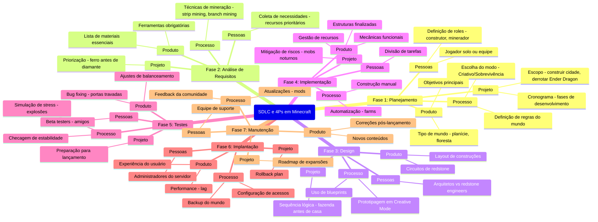

# Atividade

1. **Planejamento (Planning) – Preparando o Mundo**  
   - **Minecraft**: Antes de começar, você define se vai jogar no **Modo Criativo** (projeto bem definido) ou **Modo Sobrevivência** (requisitos flexíveis).  
   - **4Ps**:  
     - **Pessoas**: Quem vai jogar (solo ou multiplayer)?  
     - **Processo**: Definir regras (plugins, mods).  
     - **Produto**: Tipo de mundo (planície, montanhas?).  
     - **Projeto**: Objetivo (construir uma cidade, matar o Ender Dragon?).  

2. **Análise de Requisitos (Requirements) – Coletando Recursos**  
   - **Minecraft**: Minerar materiais (madeira, ferro, diamante) para construir ferramentas.  
   - **4Ps**:  
     - **Pessoas**: Quem decide os recursos necessários?  
     - **Processo**: Como minerar eficientemente?  
     - **Produto**: Itens essenciais (picareta, espada).  
     - **Projeto**: Priorizar recursos (ferro antes de ouro?).  

3. **Design (Design) – Construindo a Base**  
   - **Minecraft**: Criar plantas de construções (casas, fazendas, redstone circuits).  
   - **4Ps**:  
     - **Pessoas**: Arquitetos (builders) vs. engenheiros (redstone experts).  
     - **Processo**: Usar templates ou criar do zero?  
     - **Produto**: Design da construção (estética vs. funcionalidade).  
     - **Projeto**: Escalonamento (fazer a casa antes da fazenda?).  

4. **Implementação (Development) – Construindo de Verdade**  
   - **Minecraft**: Colocar blocos, criar mecanismos, farmar recursos.  
   - **4Ps**:  
     - **Pessoas**: Builders vs. miners vs. farmers.  
     - **Processo**: Automatizar (farms de ferro) ou manual?  
     - **Produto**: Qualidade da construção (resistente a creepers?).  
     - **Projeto**: Cumprir prazos (antes do ataque noturno?).  

5. **Testes (Testing) – Checando Falhas**  
   - **Minecraft**: Verificar se a casa não pega fogo, se a redstone funciona.  
   - **4Ps**:  
     - **Pessoas**: Testadores (quem verifica os bugs?).  
     - **Processo**: Usar **Creative Mode** para testes rápidos.  
     - **Produto**: Corrigir falhas (porta que não abre?).  
     - **Projeto**: Evitar surpresas (creeper explode sua casa!).  

6. **Implantação (Deployment) – Lançando o Mundo**  
   - **Minecraft**: Disponibilizar o mapa para outros jogares (servidor multiplayer).  
   - **4Ps**:  
     - **Pessoas**: Administradores do servidor.  
     - **Processo**: Backup do mundo.  
     - **Produto**: Experiência do jogador (lag? bugs?).  
     - **Projeto**: Manutenção contínua (atualizações).  

7. **Manutenção (Maintenance) – Atualizando e Corrigindo**  
   - **Minecraft**: Adicionar novos mods, corrigir bugs, expandir construções.  
   - **4Ps**:  
     - **Pessoas**: Moderadores e desenvolvedores de mods.  
     - **Processo**: Feedback da comunidade.  
     - **Produto**: Novos conteúdos (Nether Update).  
     - **Projeto**: Manter o servidor ativo.  

---  

